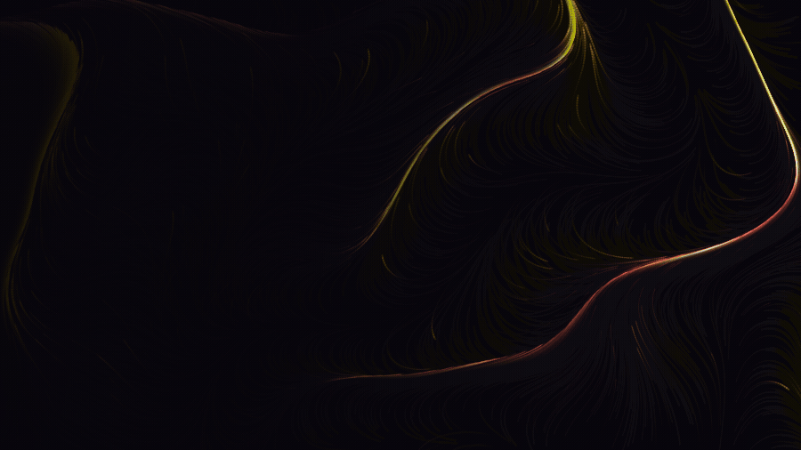
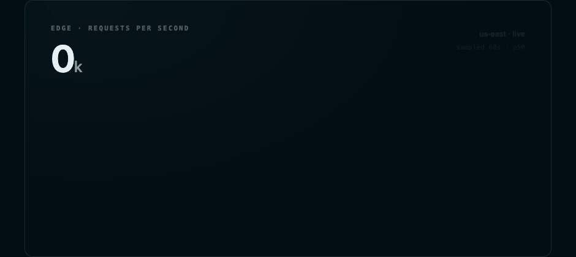

# Atelier

**Animation skills for Claude Code — and the ability to watch what it built.**

Claude can write an animation. What it can't normally do is *see* one, so it ships
`transition: all 300ms linear`, one duration for everything, no exits, no stagger, and no
idea any of it feels dead. Atelier fixes both halves: a motion skill with tuned production
recipes, and a capture script that records the running result to a GIF so the work gets
judged by watching it.



Every frame above came out of these skills — the flow field, the masked line-by-line
reveal, the type, the palette — and was recorded with the capture script.
Source: [`hero.html`](examples/hero.html).

---

## What it builds

**Shared-element flight.** The tapped cover doesn't dissolve into a new screen, it
*travels* — siblings clear out of the way first so the eye never loses the thing it chose.
FLIP, a 560ms flight, detail copy arriving 60ms apart, and the whole gesture reversing on
close. [`expand.html`](examples/expand.html)


**A chart that draws itself.** One electric mint that belongs exclusively to the series, so
colour reads as data; tabular figures so the counter doesn't reflow; a live head on the
trace that retires when it lands. [`signal.html`](examples/signal.html)



**Generative motion.** A two-octave noise field where colour is *earned* rather than
applied — deep oxblood where the flow is calm, gold only where it runs fastest, so
brightness encodes velocity. [`ember.html`](examples/ember.html)


---

## Watch your own work

The part that makes this a tool instead of a reading list:

```bash
skills/motion/scripts/capture-motion.py index.html --out motion.gif \
    --trigger "document.querySelector('#open').click()" --duration 1200
```

It drives headless Chrome over the DevTools protocol and records real composited frames, so
it works for CSS transitions, Web Animations, GSAP/Framer/Motion One, canvas and WebGL
alike. Point it at a file or a dev server, give it something to click, get back something
you can actually judge. The `critique` skill requires this step: **if anything moves, a
still is not a render.**

*Needs only Chrome/Chromium and ffmpeg — no pip installs; the DevTools WebSocket client is stdlib.*

## The motion skill

The front door. Every recipe carries durations, curves, per-stack code, a reduced-motion
variant, and the failure mode that ruins it.

| Reference | What's in it |
|---|---|
| **recipes-interface.md** | Press & hover, modal, drawer with drag-to-dismiss, dropdown, toast stacks, accordion (incl. the `height:auto` problem), tabs, list insert/remove/reorder via FLIP, drag with velocity-aware snap-back, number tickers |
| **recipes-transitions.md** | Route transitions (View Transitions API + fallback), shared-element flights, scroll reveals, parallax that doesn't jank, skeleton→content, progress states |
| **recipes-procedural.md** | The loop & delta time, spring integrator, pooled particles, trauma-based screen shake, hit-stop, ambient flow fields, chase cameras |
| **easing-and-springs.md** | Curve selection, named cubic-béziers, damping-ratio-first spring tuning, staggers, interruption |
| **principles.md** | Disney's 12 principles translated for UI and game feel, the duration scale, the accessibility floor |
| **dead-motion-diagnostic.md** | An 11-point ordered diagnostic for motion that feels dead, floaty, cheap, or janky |

## Supporting skills

| Skill | Role |
|---|---|
| **performance-craft** | Janky motion is failed motion. Compositor-friendly properties on the web; ProMotion timing, Metal overdraw and particle budgets, efficiency-core scheduling on Apple silicon; engine budgets; and a degradation ladder ordered by visual damage. |
| **critique** | The quality gate. Capture the real thing, score an 8-dimension rubric with evidence, output ranked changes with exact values. Accessibility findings outrank aesthetics. |
| **design-direction** | Sets the motion temperament and a written aesthetic point of view, so choices follow intent instead of habit. |
| **color** | Perceptual palettes in OKLCH, dark/light theme families, contrast discipline, and the glow restraint that keeps motion from becoming noise. |
| **typography-and-layout** | Type pairing, modular scale, the spacing ladder, grids and when to break them. |

## Install

**As a plugin:**

```
/plugin marketplace add jangles-byte/atelier
```
```
/plugin install atelier@atelier
```

**As plain skills:**

```bash
git clone https://github.com/jangles-byte/atelier.git
cp -r atelier/skills/* ~/.claude/skills/
```

Skills auto-trigger on relevant work — "animate this", "why does this feel dead", "add a
page transition". Each SKILL.md is a short router; depth lives in `references/` that load
only when needed, so context stays light.

## The critique protocol in use

Worked examples where measuring beat eyeballing:

- **[Dead motion, diagnosed](examples/motion-critique.md)** — two pages with identical
  markup, sampled per animation frame: progress at 40ms 11% → 49%, stagger spread
  0.0ms → 149.9ms, and a permanent `requestAnimationFrame` loop waking the CPU 60×/second
  forever to animate one 7px dot.
- **[A chart's accessibility](examples/chart-critique.md)** — library defaults where the
  most important series measured **2.53:1** on white, below the 3:1 floor for chart marks,
  and two series collapsed to **1.14:1** under simulated deuteranopia with a legend as
  their only key.
- **[A landing page, rebuilt](examples/critique.md)** — the default template rebuilt
  against a written philosophy, every text pair contrast-verified in the render.

## Contributing & license

PRs welcome — see [CONTRIBUTING.md](CONTRIBUTING.md). Principle first, exact values, no
stack lock-in. MIT.
