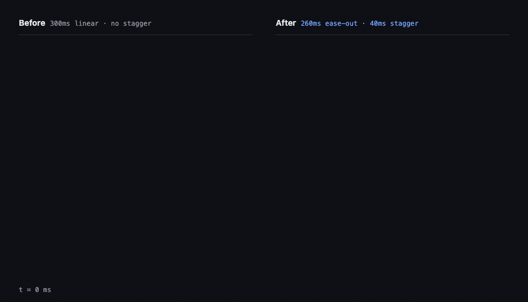
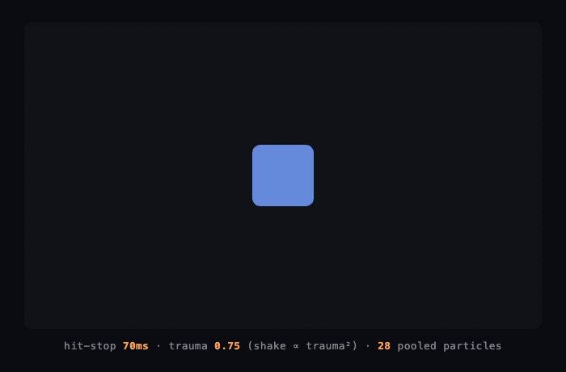
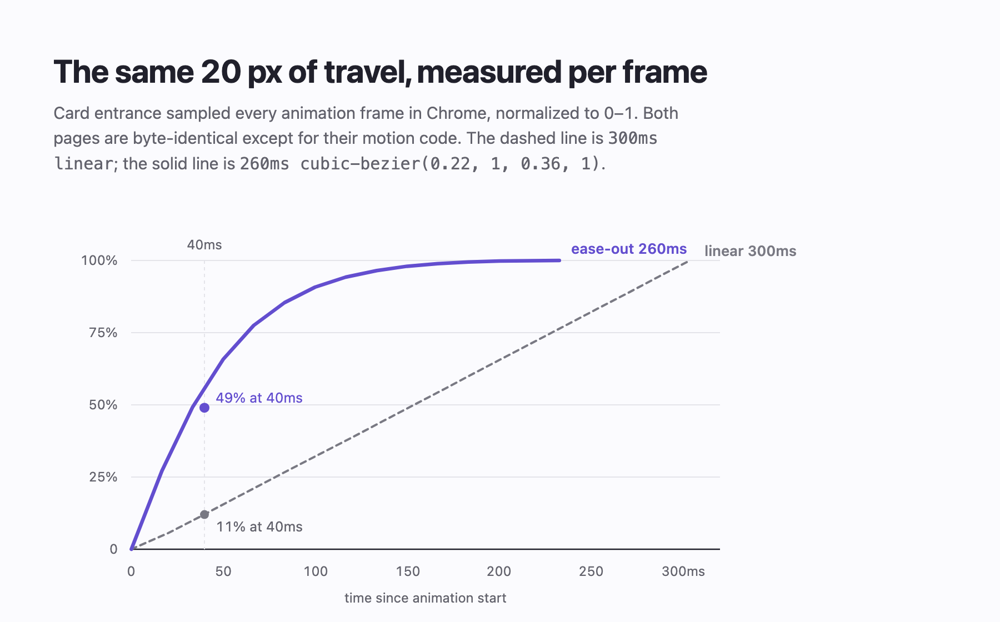

# Atelier

**Animation skills for Claude Code — and the ability to watch what it built.**

Claude can write an animation. What it can't normally do is *see* it — so it ships
`transition: all 300ms linear`, one duration for everything, no exits, no stagger, and no
idea that any of it feels dead. Atelier fixes both halves: a deep motion skill with tuned,
production-ready recipes, and a capture script that records the running animation to a GIF
so Claude can look at the result and fix what's wrong.


Everything above was produced by these skills and recorded by the capture script below —
the flow field, the masked line-by-line reveal, the type, the palette. One gold, earned by
the field's velocity. Source: [`hero.html`](examples/hero.html).

### The difference the skill makes



Left is `300ms linear`, no stagger. Right is `260ms` ease-out with a 40ms stagger. Same
markup, same pixels, same 20px of travel — the only difference is the motion code.

## Watch your own work

The thing that makes this a tool rather than a reading list:

```bash
skills/motion/scripts/capture-motion.py index.html --out motion.gif \
    --trigger "document.querySelector('#open').click()" --duration 1200
```

It drives headless Chrome over the DevTools protocol and records real composited frames —
so it works for CSS transitions, Web Animations, GSAP/Framer/Motion One, canvas, and WebGL
alike. Point it at a local file or a dev server, give it something to click, and get back a
GIF you can actually judge. The `critique` skill requires this step: if anything moves, a
still is not a render.

*Needs Chrome/Chromium, ffmpeg, and `pip install websocket-client`.*

## The motion skill

The front door. It ships tuned values, not vibes — every recipe carries durations, curves,
per-stack code, a reduced-motion variant, and the failure mode that ruins it.

| Reference | What's in it |
|---|---|
| **recipes-interface.md** | Press & hover, modal/dialog, drawer with drag-to-dismiss, dropdown, toast stacks, accordion (incl. the `height:auto` problem), tabs, list insert/remove/reorder via FLIP, drag with velocity-aware snap-back, number tickers |
| **recipes-transitions.md** | Route transitions (View Transitions API + fallback), shared-element/hero flights, scroll-driven reveals, parallax that doesn't jank, skeleton→content, progress & pending states |
| **recipes-procedural.md** | The loop & delta time, spring integrator, pooled particles, trauma-based screen shake, hit-stop, ambient/flow fields, chase cameras |
| **easing-and-springs.md** | Curve selection, named cubic-béziers, damping-ratio-first spring tuning, stagger rules, interruption |
| **principles.md** | Disney's 12 principles translated for UI and game feel, the duration scale, the accessibility floor |
| **dead-motion-diagnostic.md** | An 11-point ordered diagnostic for motion that feels dead, floaty, cheap, or janky |

The procedural recipes drive generative work too — this is a two-octave noise flow field
where colour is earned rather than decorative: deep oxblood where the field is calm, gold
only where it runs fastest, so brightness encodes velocity
([`ember.html`](examples/ember.html)).


Game feel from the same file — 70ms hit-stop, trauma-based shake with a squared falloff,
volume-conserving squash, and a pooled particle burst along the impact normal
([`juice-demo.html`](examples/juice-demo.html)):



## Supporting skills

Animation doesn't happen in a vacuum — these carry the craft around it.

| Skill | Role |
|---|---|
| **performance-craft** | Janky motion is failed motion. Compositor-friendly properties and GPU layers on the web; ProMotion/adaptive-refresh timing, Metal overdraw and particle budgets, and efficiency-core scheduling on Apple silicon; engine draw-call and fill-rate budgets; and a graceful-degradation ladder ordered by visual damage. |
| **critique** | The quality gate. Capture the real thing, score an 8-dimension rubric with evidence, output ranked changes with exact values — px, ms, curves, colors. Accessibility findings always outrank aesthetics. |
| **design-direction** | Sets the motion temperament (snappy or viscous, calm or nervous) alongside a written aesthetic point of view, so animation choices follow intent instead of habit. |
| **color** | Perceptual palettes in OKLCH, dark/light theme families, contrast discipline — including the glow and saturation restraint that keeps motion from becoming noise. |
| **typography-and-layout** | Type pairing, modular scale, the spacing ladder, grids and when to break them. |

## Install

**As a plugin (one command):**

```
/plugin marketplace add jangles-byte/atelier
```
```
/plugin install atelier@atelier
```

**As plain skills:**

```bash
git clone https://github.com/jangles-byte/atelier.git
cp -r atelier/skills/* ~/.claude/skills/
```

The skills auto-trigger on relevant work — "animate this", "why does this feel dead",
"add a page transition" — no manual invocation needed. Each SKILL.md is a short router;
depth lives in `references/` that load only when the job needs them, so context stays light.

## What the diagnostic catches

Run against a deliberately dead interaction ([`motion-critique.md`](examples/motion-critique.md)),
with every number sampled per animation frame in Chrome:

| Metric | Before | After |
|---|---|---|
| Progress at 40ms | 11% | **49%** (4.4× further) |
| Stagger spread across 5 cards | 0.0ms | **149.9ms** |
| `requestAnimationFrame` callbacks per idle second | **60** | **0** |

That last row is a permanent rAF loop waking the CPU sixty times a second, forever, to
animate one 7px dot — the kind of thing that never shows up as jank, only as battery.



## Beyond motion

The same capture-and-critique loop applies to static work. Two worked examples:

- **[A landing page](examples/critique.md)** — the default purple-gradient template
  rebuilt against a written design philosophy, with every text pair contrast-verified.
- **[A chart](examples/chart-critique.md)** — library defaults where the most important
  series measured **2.53:1** on white (below the 3:1 floor for chart marks) and two series
  collapsed to **1.14:1** under simulated deuteranopia, with a legend as their only key.

| | Before | After |
|---|---|---|
| Page |  |  |
| Chart |  |  |

## Contributing & license

PRs welcome — see [CONTRIBUTING.md](CONTRIBUTING.md). Principle first, exact values, no
stack lock-in. MIT.
