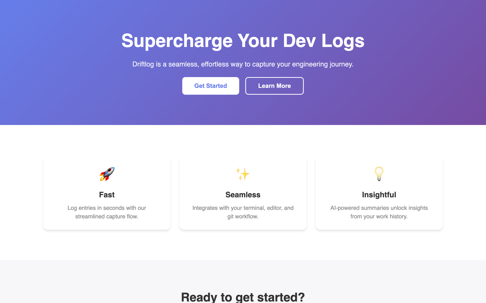
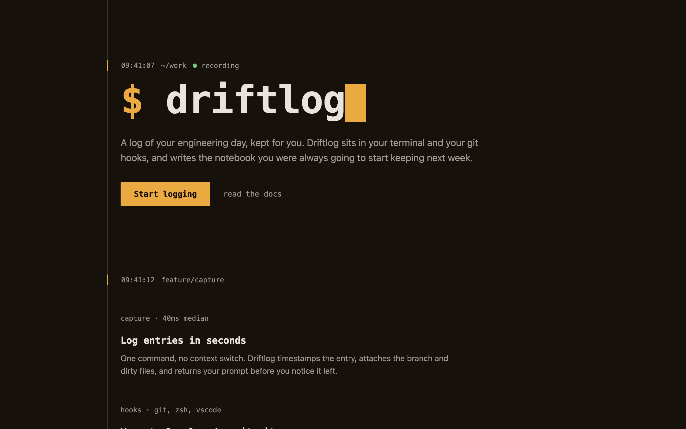

# Atelier

**Elite art direction for Claude Code — in any medium.**

Claude's default design output is competent but generic: safe fonts, predictable
layouts, timid color, lifeless motion. Atelier is a package of six deep,
principle-first skills that make Claude work like a senior art director — writing
a design philosophy before touching pixels, building color systems in OKLCH,
setting type with intent, animating with real physics, critiquing its own renders
against a rubric, and holding frame rate as a design requirement.

It is not locked to one stack. Every reference file teaches the medium-agnostic
principle first, then shows how it lands in 2–3 different stacks — CSS, Swift/Metal
or Canvas, plotting libraries, game engines. Web UI, native apps, data viz,
generative art, game graphics, slides: same principles, different renderers.

## Before / after

The same request — "build a landing page for Driftlog, a dev-log tool" — without
and with Atelier. Full artifacts, the written philosophy, and the critique that
drove the changes are in [`examples/`](examples/).

| Before (Claude's defaults) | After (Atelier workflow) |
|---|---|
|  |  |

The before page is the template every generator emits: purple gradient hero,
centered stack, three emoji feature cards — and two WCAG contrast failures.
The after page came from the package's workflow: a named direction
([Warm Terminal](examples/DESIGN.md)), a signature move (the page is a log of
itself), one rationed accent, a two-voice type system, and every text pair
contrast-verified in the rendered page.

## The skills

| Skill | What it does |
|---|---|
| **design-direction** | The front door. Interrogates purpose, audience, tone, differentiation; writes a short design philosophy with a named aesthetic point of view (and what it is *not*) before any implementation. Kills genericism at the source. |
| **color** | Perceptual palette construction in OKLCH: tinted neutrals, chroma-curved ramps, semantic tokens, dark/light themes as siblings (never inversions), computed contrast discipline, glow and saturation restraint. |
| **typography-and-layout** | Type pairing on the one-axis rule, modular scales with a brave top end, measure and line-height discipline, the spacing ladder, grids and the five sanctioned ways to break them, negative space as material. |
| **motion** | Disney's 12 principles translated for UI, procedural animation, and game feel; a duration scale; spring math (damping ratio first) portable to any language; stagger choreography; a 11-point "why does this animation feel dead?" diagnostic. |
| **critique** | The quality gate. Renders the real artifact, scores an 8-dimension rubric with evidence, and outputs ranked changes with exact values — px, ms, curves, hex/oklch — never vibes. Accessibility findings always outrank aesthetics. |
| **performance-craft** | Design that holds its frame rate. Compositor-friendly web animation; ProMotion/adaptive-refresh timing, Metal overdraw and particle budgets, E-core scheduling on Apple silicon; engine budgets; and a graceful-degradation ladder ordered by visual damage. |

## The workflow the package enforces

For any visual work:

1. **Philosophy first** — `design-direction` writes the intent before any pixels.
2. **Implement** — with `color`, `typography-and-layout`, `motion` as needed.
3. **Render the real result** — screenshot the browser, simulator, plot, or game.
4. **Critique** — run the `critique` rubric on the render; fix by exact values.
5. **Iterate** — re-render, re-measure, until the weakest rubric score is a 4.

Nothing ships on step 2. The [example critique](examples/critique.md) shows the
loop catching a real contrast defect in this repo's own "after" page on round 2.

## Install

**As a plugin (recommended — one command):**

```
/plugin marketplace add jangles-byte/atelier
```

then

```
/plugin install atelier@atelier
```

**As plain skills (git clone):**

```bash
git clone https://github.com/jangles-byte/atelier.git
cp -r atelier/skills/* ~/.claude/skills/
```

Either way, the skills auto-trigger on relevant work — "build me a landing page",
"pick a palette", "this animation feels dead", "review this screenshot" — no
manual invocation needed. Each SKILL.md is a short router; the depth lives in
`references/` files that load only when the job needs them, so your context stays
light.

## A taste of the critique skill

From [`examples/critique.md`](examples/critique.md), run against the "before"
page above:

> **Scores:** Hierarchy 2 — headline, two equal-weight hero buttons, three
> identical cards all compete… Color 1 — the exact slop-list gradient
> (#667eea→#764ba2); card body #888 on white = 3.5:1, **fails AA**…
> Distinctiveness 1 — fails the swap test, fails the describability test.
>
> **Changes (ranked):**
> 1. **[accessibility]** Card body text: #888 → #555 (7.4:1) — clears AA now,
>    independent of the redesign.
> 2. **[accessibility]** All interactive elements: add `:focus-visible { outline:
>    2px solid currentColor; outline-offset: 2px }`…
> 3. **[color]** Replace the gradient system: ground the page in
>    oklch(18% 0.015 75) charcoal-amber; one accent oklch(78% 0.14 75) reserved
>    for the prompt, the primary CTA, and the cursor…

Exact locations, exact values, ranked, accessibility first. That's the contract.

## Design lineage

Atelier stands on documented shoulders: the philosophy-first workflow generalizes
Anthropic's [`algorithmic-art` and `canvas-design`](https://github.com/anthropics/skills)
skills; the router-plus-references architecture and motion discipline take cues
from [genjutsu](https://github.com/AThevon/genjutsu); the critique framing
answers the gaps in existing art-direction skills (no rubric, no exact values,
web-only). The canon inside: Disney's 12 principles, damped-harmonic-oscillator
spring theory, OKLCH color science, WCAG/APCA contrast, gestalt composition, and
platform rendering pipelines.

## Contributing & license

PRs welcome — see [CONTRIBUTING.md](CONTRIBUTING.md) (principle first, exact
values, no stack lock-in). MIT license.
