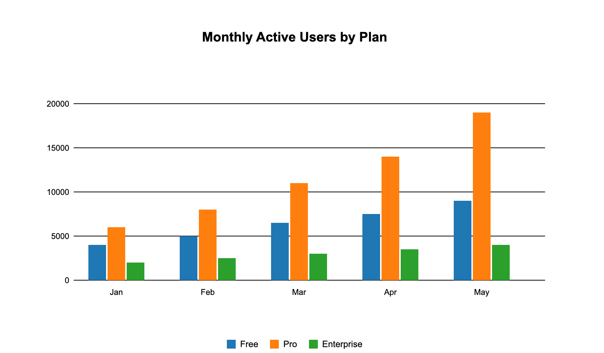
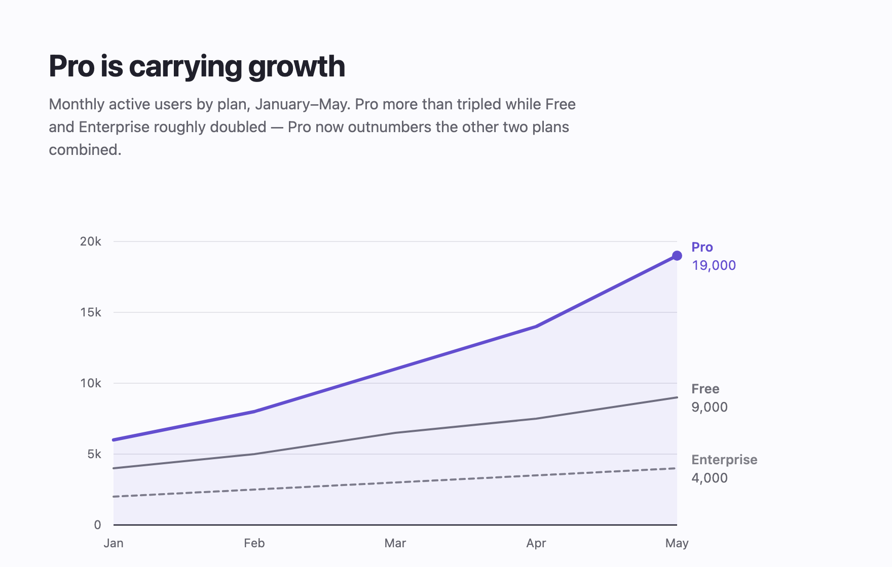

# Critique: a default grouped-bar chart (second medium)

*This example exists to test the package's central claim — that the principles are
medium-agnostic. Same `critique` protocol as [`critique.md`](critique.md), applied
to data visualization instead of a landing page. Nothing here was tuned in advance.*

No design philosophy on file. **Inferred intent (stated, per the skill's rule):**
show how each plan's user base is trending so a reader can see which plan is
driving growth.

## Inventory

720×360 SVG on white. Centered 18px bold Arial title "Monthly Active Users by
Plan". Five month-groups × three bars, category-10 defaults (#1f77b4 Free,
#ff7f0e Pro, #2ca02c Enterprise). Five full-opacity pure-black gridlines. 11px
black Arial tick labels, y-axis in raw units (0, 5000, 10000…). Legend of three
square swatches centered below the plot.

## Scores

- **Hierarchy 2** — fifteen bars at identical weight and saturation; the plot is a
  picket fence with no entry point. The finding (Pro tripling while the others
  crawl) is present in the data and invisible in the render.
- **Color 1** — the literal charting-library default palette; three fully
  saturated hues competing, none carrying meaning beyond identity. **Measured:**
  Pro #ff7f0e sits at **2.53:1** on white — below the 3:1 floor for chart marks,
  and it's the most important series.
- **Typography 2** — Arial at two sizes (18px title, 11px labels), a 1.6× total
  range; no tabular numerals; raw "20000" instead of "20k".
- **Spacing & alignment 3** — internally consistent, but the title is centered
  over a left-aligned plot area, so the two most prominent elements share no edge.
- **Motion** — n/a (still).
- **Consistency 3** — uniformly default, therefore self-consistent.
- **Accessibility 1** — the 2.53:1 failure above, plus hue as the sole channel:
  the legend is the only link between color and series. **Measured under simulated
  deuteranopia, Free/Enterprise separate by 1.14:1** — for a red-green colorblind
  reader those two series are the same color, and nothing else distinguishes them.
- **Distinctiveness 1** — the default output of every charting library; fails both
  the swap test and the describability test.

## Changes (ranked)

1. **[accessibility] Kill hue-as-sole-channel:** delete the legend; label each
   series at its line end (`x=634`, at the series' final y) — position and text,
   so the chart survives greyscale and colorblindness. Add a dash pattern
   (`stroke-dasharray="5 4"`) to Enterprise as a second non-hue channel.
2. **[accessibility] Pro mark contrast:** #ff7f0e (2.53:1) → oklch(52% 0.19 285)
   ≈ #634ecf (**5.77:1**), clearing the 3:1 mark floor with headroom.
3. **[hierarchy] One hero series:** give Pro the only chroma on the page
   (oklch 52% **0.19** 285) at 3.25px stroke; demote Free and Enterprise to
   near-achromatic greys (oklch 55%/60% **0.012–0.015** 285) at 2px. Emphasis by
   chroma rather than lightness keeps all three legible while making one dominant.
4. **[hierarchy] Change the form:** grouped bars → lines. The question is trend and
   divergence over time; bars encode fifteen discrete comparisons and hide the one
   comparison that matters. Add a 7%-opacity accent area fill under Pro only.
5. **[color] Gridlines:** #000 (21:1) → oklch(92% 0.008 285) hairlines, and drop
   the 0-line back to var(--ink) at 1.25px — chart junk recedes, the baseline stays.
6. **[typography] Title carries the finding:** "Monthly Active Users by Plan" 18px
   centered → "Pro is carrying growth" at 30px/700, tracking −0.02em, left-aligned
   to the plot's left edge, with a 15px muted deck stating the numbers.
7. **[typography] Numerals:** add `font-variant-numeric: tabular-nums` throughout;
   y-axis "20000" → "20k"; end-of-line values printed at 13px ("19,000").

## The iterate pass — what re-measuring caught

Re-rendering and re-measuring (protocol step 5) caught a defect the eye passes
over: the new Pro area fill tints the background *behind* the two grey lines, so
their true background is rgb(241,240,250), not paper. Enterprise measured
**2.99:1** there — 0.01 under the floor, while measuring a comfortable 3.30:1
against paper.

**Change:** `--ctx-2` oklch(64% 0.012 285) → oklch(60% 0.012 285).
**Re-measured:** 3.51:1 on the fill, 3.87:1 on paper. Passing.

This is the second time in this repo that "check the composited background, not
the token" caught a real failure — the same class of bug as the `--text-faint`
defect in [`critique.md`](critique.md). It is the strongest argument for the
render-and-measure step: both defects were invisible in review and unambiguous
in arithmetic.

## Result

| Before | After |
|---|---|
|  |  |
