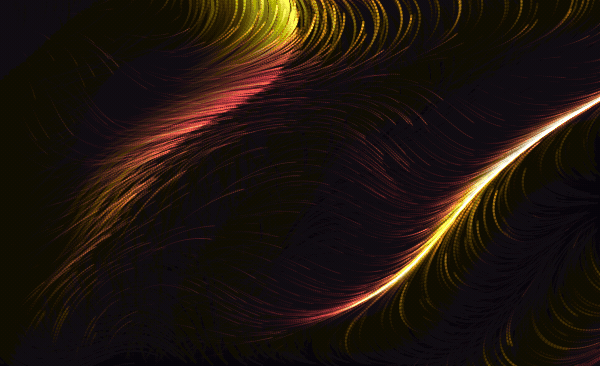
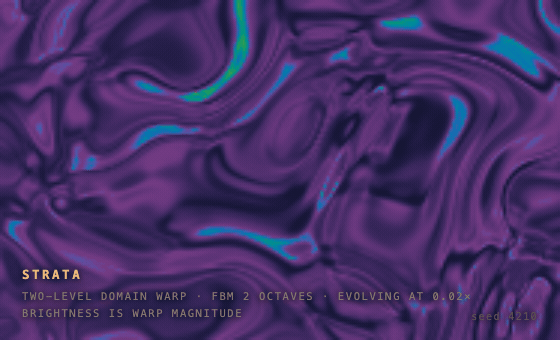
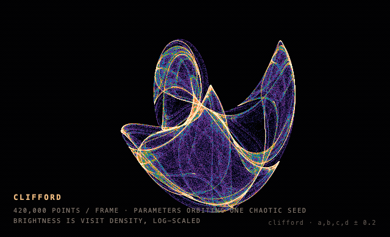
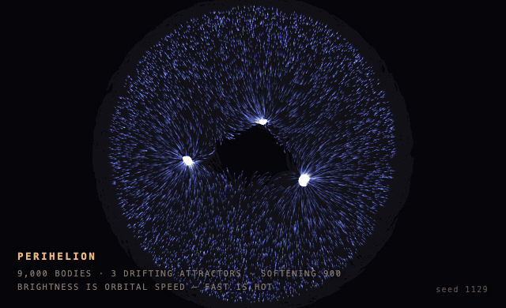
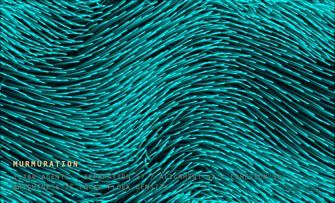

# Generative gallery

Pieces, not sketches. Each is a single self-contained file with a stated intent, a seeded
PRNG so the composition is reproducible, and one property that earns colour — the rule the
`generative-motion` skill insists on, because colour that encodes nothing is what makes
algorithmic work read as a demo.

All recorded with the package's own capture script.

---

## Ember — flow field

Embers on a thermal. A two-octave noise field sampled as an angle; colour is earned by
velocity, so deep oxblood is calm and gold is fast. Brightness is a reading of the field,
not a decoration on it.

 · [source](ember.html)

## Strata — domain-warped noise

Ink held in glass. Noise fed into the coordinates of more noise, twice — the trick that
turns clouds into marble. Only the innermost layer evolves, so the structure breathes
instead of sliding. Rendered at a third scale and upsampled, which costs nothing because
the field has no high-frequency detail to lose.

 · [source](warp.html)

## Clifford — deterministic chaos

`x' = sin(a·y) + c·cos(a·x)`. One point, iterated 420,000 times a frame. No physics and no
randomness: the filigree is simply where the orbit chooses to spend its time, and
brightness is visit density on a log scale so the faint structure survives beside the
dense core.

The parameters **orbit** a known-chaotic seed rather than interpolating between two of
them — a straight lerp between two chaotic sets passes through non-chaotic parameter space
where the whole attractor collapses to a single point.

 · [source](attractor.html)

## Perihelion — n-body with trails

A sky of small bodies falling around three slow masses. Colour is earned by speed, which
here is what heat physically is: bodies brighten at perihelion and cool at apoapsis, so the
image reads as orbits rather than scribble. Softening in the force law is mandatory —
without it, close passes slingshot to infinity and the piece empties itself.

 · [source](orbits.html)

## Murmuration — boids

A flock at dusk. Three local rules, no leader, no path; the shape of the whole is an
accident of everyone watching their neighbours. Colour is earned by local density, so knots
glow and stragglers go dark. Speed is clamped to a *band* rather than a maximum, because
birds do not hover.

 · [source](boids.html)

---

## What isn't here

**Physarum.** I built it and could not get it to form a real network at CPU scale — it
kept fusing into a handful of thick trunks instead of branching lace, across ten rounds of
tuning occupancy, sensor distance, diffusion and step size. The technique is documented in
[`systems.md`](../../skills/generative-motion/references/systems.md) with the parameter
ranges that matter, but it genuinely wants a GPU and hundreds of thousands of agents, and
shipping a weak version of the most striking system in the file would have been worse than
shipping none.

Also documented but not yet built: reaction–diffusion, differential growth, metaballs,
interference/moiré, and cyclic cellular automata.
