# Recipe gallery

Every recipe in the `motion` skill, running. Each demo is a single self-contained file
that autoplays on a loop; the spec line in the corner of each frame states the actual
values, so the GIF documents the recipe.

Recorded with the package's own capture script:

```bash
skills/motion/scripts/capture-motion.py examples/recipes/modal.html --out modal.gif --duration 3400
```

---

## Interface — [`recipes-interface.md`](../../skills/motion/references/recipes-interface.md)

### Press & hover
Contact should feel instant and recovery can have personality: 80ms down, 130ms back
through an overshoot curve. Composes lift, shadow and colour rather than dimming opacity.

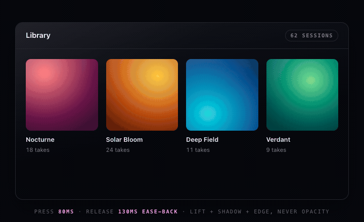 · [source](press-hover.html)

### Modal
Enters 300ms ease-out, exits 240ms ease-in — departures need less explanation than
arrivals. Grows from the trigger's origin so it explains where it came from.

 · [source](modal.html)

### Drawer
Edge-anchored, so it travels from its edge. 450ms open, 360ms close.

 · [source](drawer.html)

### Dropdown
150ms, not 300 — menus are opened dozens of times a session and any weight becomes
friction. Origin matches the anchored edge; utility menus arrive as one block, not staggered.

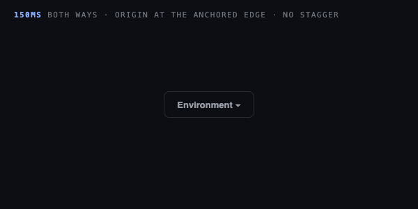 · [source](dropdown.html)

### Toast stack
The hard part isn't the entrance, it's the gap: when one leaves, the survivors FLIP up
220ms instead of snapping. Snapping is what makes toast stacks feel cheap.

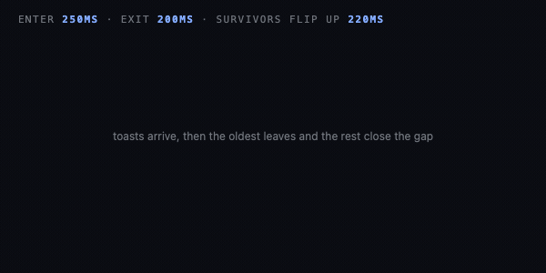 · [source](toast.html)

### Accordion
The `height: auto` problem solved with `grid-template-rows: 0fr → 1fr` — no measuring
`scrollHeight`, no layout thrash, survives content changes. Chevron trails 80ms behind.

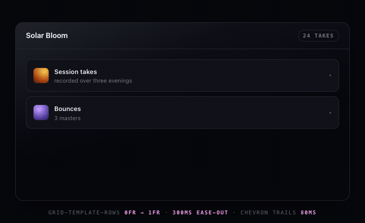 · [source](accordion.html)

### Tabs
The indicator slides 250ms because the travel *is* the information; content crossfades
150ms. Never both a slide and a fade on the same element.

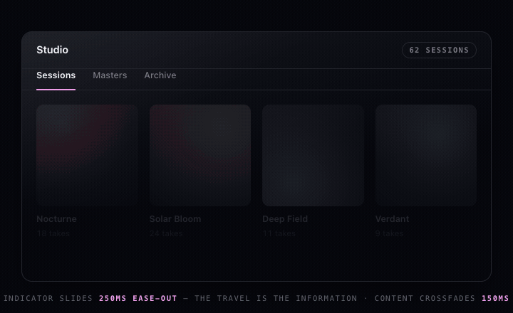 · [source](tabs.html)

### List reorder (FLIP)
Measure first, mutate, measure last, invert, play. Reorders move together at 300ms so the
swap reads as one event.

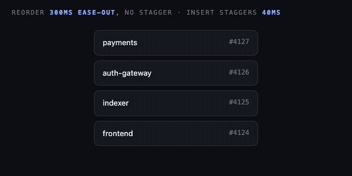 · [source](flip-list.html)

### Drag with snap-back
1:1 while held — easing the drag itself destroys direct-manipulation feel — then release
into a spring so the momentum carries. The case tweens genuinely cannot do well.

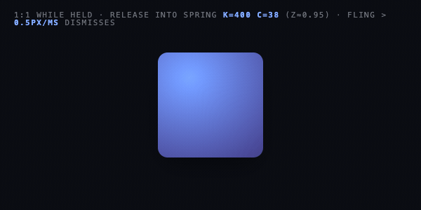 · [source](drag-snapback.html)

### Number ticker
600ms easeOutQuint with tabular figures, because a number that reflows as it counts is a
number nobody trusts. A 120ms colour pulse carries the direction.

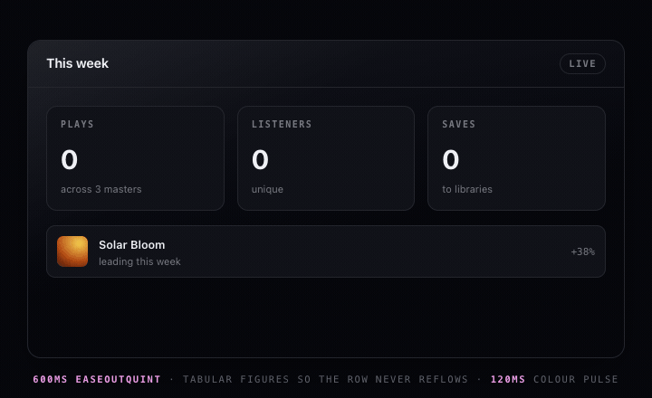 · [source](number-ticker.html)

---

## Transitions — [`recipes-transitions.md`](../../skills/motion/references/recipes-transitions.md)

### Route transition
Direction encodes hierarchy: drilling in slides one way, back reverses it. Getting this
backwards is disorienting in a way users feel but can't name.

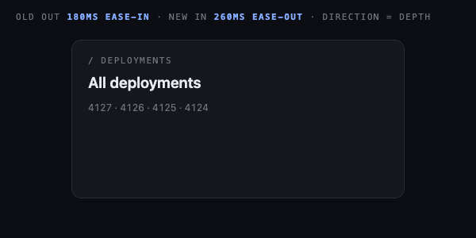 · [source](route-transition.html)

### Shared element
The tapped thing travels instead of dissolving, and siblings clear out of the way first.
The strongest orientation tool there is.

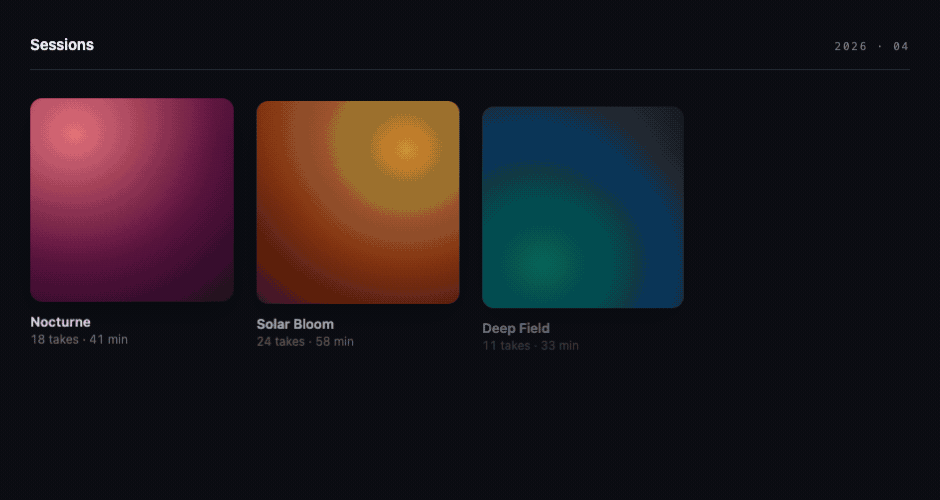 · [source](../expand.html)

### Scroll reveal
16px of travel, fires **once**, and finishes before the element reaches reading position.
Elements that re-animate on scroll-up feel broken.

 · [source](scroll-reveal.html)

### Parallax
Two layers at 18% and 31% of scroll, transforms only. More layers or bigger offsets
produce a seasick effect and multiply compositing cost.

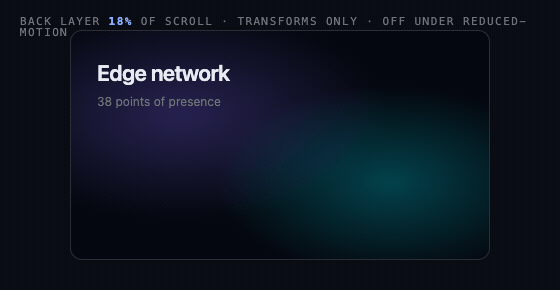 · [source](parallax.html)

### Skeleton → content
The skeleton matches the final layout's geometry, or the swap causes a reflow jump that
costs more than the skeleton bought. 150ms crossfade; instant swaps flash.

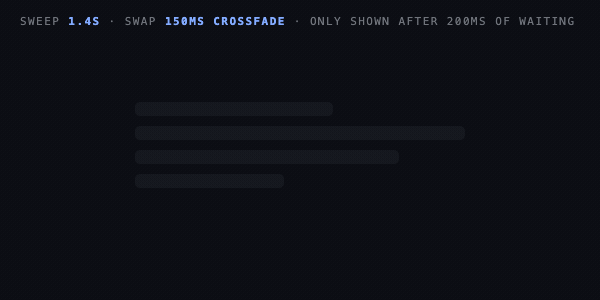 · [source](skeleton.html)

### Progress & pending
The rare correct use of linear: the machine really is progressing uniformly, and easing it
would be a lie. The button keeps its width while swapping label for spinner.

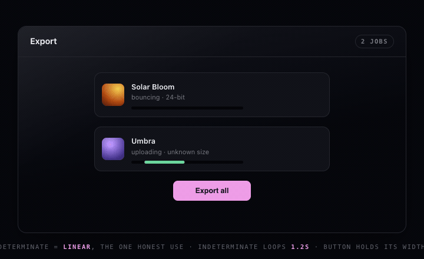 · [source](progress.html)

---

## Procedural — [`recipes-procedural.md`](../../skills/motion/references/recipes-procedural.md)

### Spring damping ratios
Same integrator, three ζ. Tune ζ first — it sets character; stiffness only sets speed.

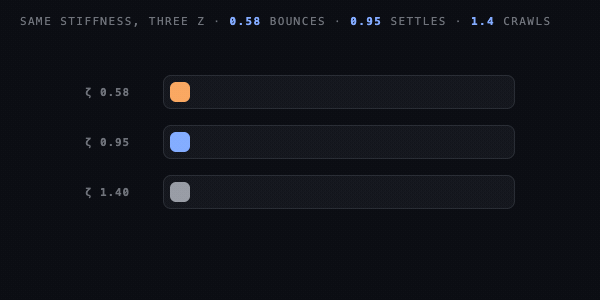 · [source](spring-damping.html)

### Particles
Pooled, never allocated in the loop. Vary speed, size and lifetime or the burst reads as a
machine; fade quadratically and emit in a cone toward the impact normal.

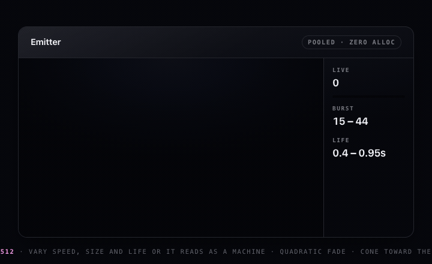 · [source](particles.html)

### Screen shake
One decaying trauma value, amplitude ∝ trauma², driven by smooth noise. Random jitter
reads as a rendering bug; coherent noise reads as force.

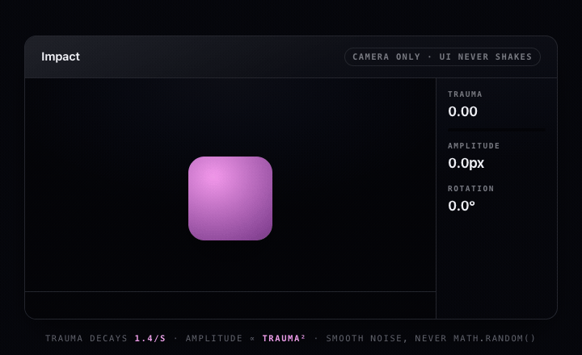 · [source](screen-shake.html)

### Hit-stop
70ms at 5% speed on contact. The pause *is* the punch — and freezing to 5% rather than 0
keeps it feeling alive.

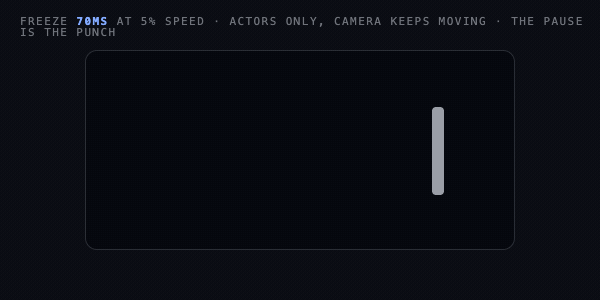 · [source](hit-stop.html)

### Chase camera
`pos = target + (pos − target) · e^(−k·dt)` — the frame-rate-independent form. The naive
`pos += (target − pos) * 0.1` runs twice as fast at 120Hz and never actually arrives.

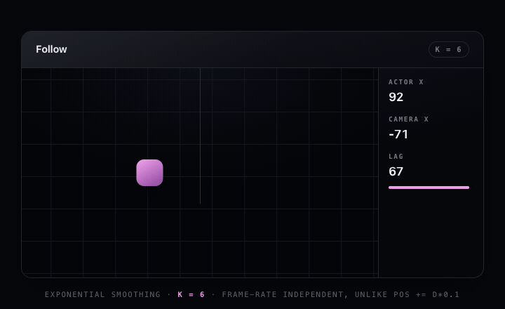 · [source](chase-camera.html)

### Ambient field
Generative motion at sub-perceptual speed, where colour is earned by velocity.

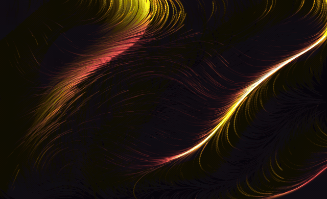 · [source](../ember.html)
